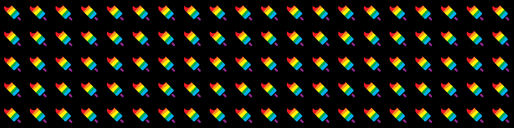

popsiclepropaganda
==================

> Exploring the Cardano Blockchain



## Overview

This is a project to explore Cardano concepts by implementing them. Currently focusing on wallets, transactions, native assets and NFTs. I am planning to learn [Plutus](https://developers.cardano.org/docs/smart-contracts/plutus) development for smart contracts and dApps on Cardano.

This scaffold can run with either `docker-compose` (easy) or with the equivalent stack installed from source or from release binaries for [cardano-node](https://github.com/input-output-hk/cardano-node/releases/tag/1.34.1) and [cardano-wallet](https://github.com/input-output-hk/cardano-wallet/releases/tag/v2022-01-18) (more advanced). Personally I have mostly abandoned the docker stack as I find docker to be not so performant with the weight of the blockchain applications running on `macos`.

This project is not intended to walk through getting your local environment set up for Cardano development. In short, for installing the stack locally I have created variables and functions in my `.bashrc` file to make things easier. I installed the binaries to `~/.local/bin/...` and I keep my `configurations`, `db` and `socket` at `~/cardano`. I am on `macos`. Check the [.bashrc.example](./.bashrc.example) for what my local stack config looks like.

#### Faucet scripts

This project has a client layer of low-level scripts called the `faucet` which act as a sort of `cardano-cli` sandbox for the Testnet. You can find them at [./app/utils/rawtx/index.js](./app/utils/rawtx/index.js). There are exploratory methods for doing things like sending ADA, [minting native tokens](https://developers.cardano.org/docs/native-tokens/minting) and [NFTs](https://developers.cardano.org/docs/native-tokens/minting-nfts), [burning tokens](https://developers.cardano.org/docs/native-tokens/minting#burning-token) and sending tokens. You can fund your `payment.addr` with `tADA` from the [Testnet faucet](https://developers.cardano.org/docs/integrate-cardano/testnet-faucet/).

#### cardano-wallet-js

This project is also using [cardano-wallet-js](https://developers.cardano.org/docs/get-started/cardano-wallet-js) with a `CRUD` API so you can Create, Read/Recover, Update and Destroy your wallets. One main objective is to utlize `cardano-wallet-js` to complete a fully functional wallet application. Another is to complete the `faucet` playground so one can send coin, tokens and NFTs between a local `payment.addr`, and a wallet.

## Development

#### Install

To install the package dependencies and local `.env` config:

- `yarn`

The default `.env` environment variables are as follows but have multiple values:

- `NETWORK`: Default is `testnet`. Can be `mainnet`.
- `BROWSER`: Default is `none` to disable `cra` default browser.
- `NODE_ENV`: Default is `development`. Can be `production`.
- `DEV_STACK`: Default is `docker`. Can be `source` to run from source.

## From source

When running from source make sure your `cardano-wallet` server is using port `8090`. Run your `cardano-node` and `cardano-wallet`. Then you can start the nodejs app.

- `yarn app`

## With docker-compose

- `yarn dc:up`
- `yarn dc:down`

The [docker-compose](./docker-compose.yml) file is from [cardano-wallet](https://github.com/input-output-hk/cardano-wallet). The [cardano-nodejs](https://hub.docker.com/r/kitajchuk/cardano-nodejs) service has been added which runs a [nodejs](https://nodejs.org/en/) container with [cardano-cli](https://developers.cardano.org/docs/get-started/running-cardano#querying-the-cardano-blockchain). The [CARDANO_NODE_SOCKET_PATH](https://developers.cardano.org/docs/get-started/running-cardano#querying-the-cardano-blockchain) environment variable is set to the shared `node-ipc` volume between the services. This nodejs container can run any nodejs app you want from the `./app` directory which mounts as a shared volume between your host machine and the nodejs container. So everything in the local app directory is available in your running nodejs docker container.

#### cardano-nodejs

The `cardano-nodejs` image is built from the [Dockerfile](./docker/Dockerfile) in this project.

```shell
# build from ./docker/Dockerfile
docker build --file ./docker/Dockerfile --tag kitajchuk/cardano-nodejs:1.33.0 .

# publish to docker hub
docker push kitajchuk/cardano-nodejs:1.33.0
```

## Frontend

- `yarn cra:start`
- `yarn electron:dev`

The frontend is currently a [create-react-app](https://create-react-app.dev) frontend. It can be loaded via [electron](https://github.com/electron/electron) so this can be desktop software. Currently it is not a very robust electron implementation, however many good concepts can be lifted from [electron-react-boilerplate](https://github.com/electron-react-boilerplate/electron-react-boilerplate) to make it better. The goal is to have minimal boilerplate overhead which is why we're not using a boilerplate like electron-react-boilerplate wholesale.

## NFTs

Example Popsicle Propaganda NFTs were minted on the Cardano Testnet with these low-level scripts. They were minted by a testnet `payment.addr` and sent to testnet wallets.

- [PP1](https://testnet.cardanoscan.io/token/6073ac5ca6373410319f896ca88d33094d5da8d37d505ab70848b90b505031)
- [PP2](https://testnet.cardanoscan.io/token/b9f1705170d75f144a4fd0636c2928b2bb39a5ab4db343978a0a1568505032)